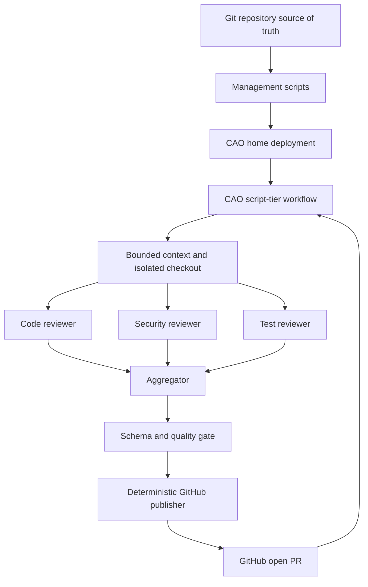

# Architecture and CAO discovery

## Installed contract (2026-09-27)

`cao --version` reported **2.5.0**. The installed CLI provides `workflow validate/list/get/delete/run/status/result/resume` and `profile validate/list/remove`; it does **not** provide workflow create/update. `cao workflow run NAME --input key=value` uses a durable run id. `workflow validate` is an HTTP request to `cao-server`, whereas the local script linter can run without a server. Profile files are Markdown with YAML frontmatter. `cao install FILE --provider codex` copies a profile into the local agent store and projects it for the provider. The current CAO workflow directory is `$CAO_HOME_DIR/workflows` (default `~/.aws/cli-agent-orchestrator/workflows`). These facts were checked against CLI help and the installed CAO source.

One Python script contains the runtime logic because CAO copies and executes that single file from its workflow directory. It declares static `INPUTS` and invokes three reviewers in parallel per patch chunk, then an aggregator and a publisher profile presentation gate through `cao_workflow.step(..., recovery="manual")` before `emit_output`. Each invocation has a stable step ID, so CAO records the reviewer and gate steps. A failed step, invalid response, or rejected publisher gate blocks publication.

The profiles request `allowedTools: []` and a named Codex profile with read-only sandbox. CAO 2.5.0 cannot natively enforce Codex `allowedTools`, and its interactive provider can send a prompt to a shell after a Codex bootstrap failure. To keep PR text out of that shell, each step receives only `: CAO_REVIEW_INPUT_<random hex>`; `:` is a shell no-op. The actual bounded input is in a mode `0600` JSON file under the fixed, mode `0700` workspace root, which the profile may read once. CAO may prepend curated memory before this token; the no-op guarantee applies only when that injected block is empty or memory injection is disabled. Invalid terminal output fails closed. The Python workflow keeps the `gh` write operation outside model steps. Each PR checkout stays in a separate temporary child directory. No source checkout occurs in this management repository.

The management state records hashes and project path. It is deployment ownership metadata, not the source of truth. Workflow index rows are derived from files in CAO's workflow directory. Install validates before replacing owned files; unowned or modified files cause a hard failure. Status compares source, recorded hash, and runtime bytes.

## Review and apply composition

`scripts/review_apply.py` is an external coordinator. The installed 2.5.0 shim has
no child-workflow call; the coordinator submits two independent CAO runs, persists
explicit run IDs before submission, waits for completed structured review output,
and authenticates the unique owned GitHub review before starting apply. It checks
the exact deployed files and their profile contexts against manifest sources.

`github-pr-apply` runs its model from the fixed carrier root, with the PR checkout
in a separate child directory that is never the model's working directory. A separate
read-only profile proposes bounded exact replacements and a status for every
original comment. Deterministic code validates the entire proposal before writing
the candidate. Docker tests operate on a disposable credentialless copy without
network access. Only the deterministic publisher can commit/push a fully tested,
complete candidate to a same-repository, unprotected, allowlisted PR branch.

The read-only profile denies writes and removes inherited shell environment; its
one-carrier-file read restriction remains soft policy, as with the reviewers.
It does not isolate every readable file in CAO's user home. Do not treat this
profile as a filesystem credential denylist. Runtime account trust remains an
operational prerequisite. See the [full contract](GITHUB-PR-REVIEW-APPLY-DESIGN.md).
