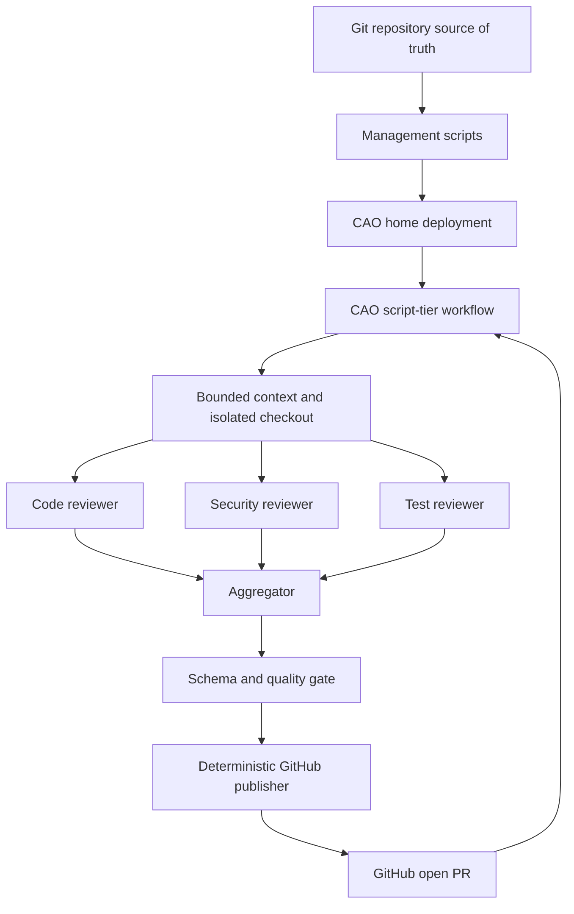

# Architecture and CAO discovery

## Installed contract (2026-09-27)

`cao --version` reported **2.5.0**. The installed CLI provides `workflow validate/list/get/delete/run/status/result/resume` and `profile validate/list/remove`; it does **not** provide workflow create/update. `cao workflow run NAME --input key=value` uses a durable run id. `workflow validate` is an HTTP request to `cao-server`, whereas the local script linter can run without a server. Profile files are Markdown with YAML frontmatter. `cao install FILE --provider codex` copies a profile into the local agent store and projects it for the provider. The current CAO workflow directory is `$CAO_HOME_DIR/workflows` (default `~/.aws/cli-agent-orchestrator/workflows`). These facts were checked against CLI help and the installed CAO source.

One Python script contains the runtime logic because CAO copies and executes that single file from its workflow directory. It declares static `INPUTS`, uses `cao_workflow.step(..., recovery="manual")`, explicit stable step IDs, three parallel reviewer calls per patch chunk, an aggregator, a publisher profile presentation gate, then `emit_output`. The three reviewers finish before aggregation. A failed reviewer or rejected publisher gate blocks publish. CAO's journal retains step results and requires explicit recovery decisions for unsettled steps.

The profiles request `allowedTools: []` and a named Codex profile with read-only sandbox. CAO 2.5.0 cannot natively enforce Codex `allowedTools`, so `codexProfile` is required to avoid its default `--yolo` launch. The Python workflow keeps the `gh` write operation outside agent steps. Reviewers receive bounded text and the checkout is created only in an isolated temporary directory. No source checkout occurs in this management repository.

The management state records hashes and project path. It is deployment ownership metadata, not the source of truth. Workflow index rows are derived from files in CAO's workflow directory. Install validates before replacing owned files; unowned or modified files cause a hard failure. Status compares source, recorded hash, and runtime bytes.
