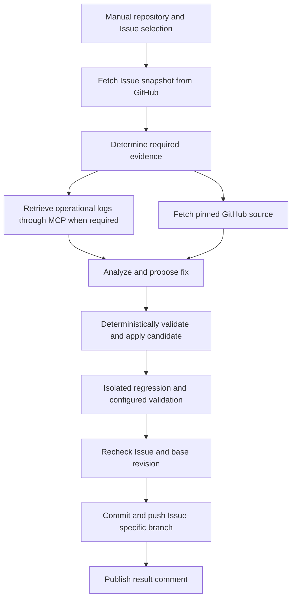

# GitHub Issue Fix and Branch Push Workflow Design

Status: Proposed. This document defines a new workflow; it does not describe an
installed or implemented automation.

## Purpose and independent execution

`github-issue-fix` reads an explicitly selected GitHub Issue, obtains source from
GitHub, develops a bounded fix and regression tests, validates the candidate,
commits it, and pushes an Issue-specific branch. It then records the branch,
commit, and validation summary in an Issue comment.

The workflow accepts both human-authored Issues and Issues created by the
[MCP Exception Issue Workflow](MCP-EXCEPTION-ISSUE-DESIGN.md). It does not require
that workflow to have run, share its local state, or remain installed. The user
starts this workflow manually with a repository and Issue number.

All operational logs used to understand or validate an incident must be
retrieved through configured MCP servers. Source context must be obtained from
GitHub at resolved commit SHAs. Issue log excerpts are discovery hints: re-query
MCP before treating the records as verified operational evidence. Ordinary
Issues that require no operational logs can proceed from their specification,
GitHub source, and local regression-test results.



## CAO integration and public interface

Use the inspected CAO 2.5.0 script-tier contract with static `WORKFLOW`, `VERSION`,
and `INPUTS`, and the `cao_workflow` shim's `get_inputs()`, `step()`, and
`emit_output()` functions. The proposed initial version is `v1`.

Register the workflow and its dedicated `issue-fixer` profile in `manifest.json`.
The profile is independent of the exception workflow's triager. The workflow is
a self-contained deployed Python script; it must not import sibling modules
from the manager checkout or CAO server internals. Reuse the established
carrier, candidate-edit validation, and container-isolation patterns as design
patterns rather than importing the existing PR workflow at runtime.

Extend the management launcher with Issue-specific inputs and ownership/hash
checks, while preserving existing PR workflows and their defaults. Proposed
interfaces, available after implementation:

```bash
# Develop, validate, commit, and push the fix.
./scripts/run.sh github-issue-fix --repository owner/repo --issue 123 \
  --policy /absolute/operator/issue-fix-policy.json

# Develop and validate a candidate without GitHub writes.
./scripts/run.sh github-issue-fix --repository owner/repo --issue 123 \
  --policy /absolute/operator/issue-fix-policy.json --apply-mode patch

# Reconcile or continue an interrupted execution using its frozen inputs.
./scripts/run.sh github-issue-fix \
  --resume /absolute/operator/issue-fix-state/executions/EXECUTION.json
```

| Input | Requirement and behavior |
| --- | --- |
| `repository` | Required GitHub `owner/name`, present in operator policy |
| `issue_number` | Required positive integer, mapped from `--issue` |
| `policy_path` | Required absolute operator-owned policy path outside model workspaces |
| `apply_mode` | `push` by default; `patch` retains a validated candidate without GitHub writes |

The selected number must refer to an open Issue rather than a pull request.
Manual selection authorizes processing that Issue within the configured policy;
Issue content does not authorize arbitrary repositories, commands, or branches.

The launcher also accepts optional `--state-root` on initial submission and
`--resume` for recovery. The default root is the persistent private location in
operator policy. Resume validates the journal's location/ownership/schema and
rejects repository, Issue, policy, and mode overrides. It does not create a new
development attempt merely because a launcher response was lost.

Before CAO submission, allocate a 32-character hexadecimal execution ID,
derive an explicit CAO run ID, and persist the launcher journal with its frozen
inputs and expected policy/resource digests. Print the journal path, then submit
the recorded run ID. Pass the trusted execution-state path and expectations as
internal workflow inputs. Persist every run identity before its submission.
Bind resource identity only to this workflow, its fixer, and its named Codex
configuration; unrelated manifest entries do not affect recovery.

The internal workflow inputs are `execution_state_path` (string),
`expected_policy_digest` (string), `expected_resource_digest` (string), and
`recovery_only` (boolean, default false). They come only from the trusted launcher;
Issue content cannot select a journal or a recovery action.

The launcher journal owns CAO submission/result reconciliation. The workflow's
private execution state owns candidates, tests, commit SHA, and publication.
An optional future [polling Handler](GITHUB-POLLING-AUTOMATION-DESIGN.md) references
that same journal for an explicitly selected Issue. It does not own or duplicate
the workflow's side effects, and neither the log workflow nor Issue discovery
automatically invokes this manual fix workflow.

## Operator policy and execution boundaries

Validate a regular, non-symlink policy file owned by the execution user with
mode `0600`. Its repository entry defines:

- Fix base branch, defaulting to the repository's GitHub default branch.
- Editable source/test paths, allowed additional context, and allowed new files.
- Generated branch prefix `cao/issue-` and Git author identity.
- Preloaded immutable container image and mandatory build/test argv commands.
- Private workspace, state, and candidate artifact locations.
- MCP connections, tool mappings, service/environment bindings, and deployment
  revision resolution for Issues requiring incident evidence.
- Credential references and bounded context/test budgets.

CAO's inspected script runner constructs its environment and does not forward
arbitrary authentication variables from the API process. The deterministic
workflow resolves credentials from operator-controlled storage. Do not pass
secret values through CAO inputs, carrier files, model prompts, state, commits,
or Issue comments.

The model proposes changes through a named read-only Codex profile with
`approval_policy=never` and `shell_environment_policy.inherit=none`.
`allowedTools` alone is insufficient to prevent CAO's default unrestricted
Codex launch. Use the existing shell-inert carrier-token pattern, private input
files, and an empty/disabled injected memory block. Target repository content
does not become developer instructions for the model.

The deterministic workflow owns MCP calls, GitHub reads, filesystem changes,
tests, commits, and GitHub publication. Models do not execute Issue-provided
commands or publish. Test commands originate exclusively from operator policy.
The service account remains an operational trust boundary: a read-only profile
does not provide complete filesystem isolation from every readable credential.

## Processing stages

### 1. Lock and Issue snapshot

Acquire a repository/Issue lock on the single execution host. Read the Issue and
its comments from GitHub, verify the repository and open state, and retain a
snapshot of the selected specification and supporting discussion. Include all
comments within the configured budget; if a complete required discussion
exceeds the budget, stop with `needs_context` rather than silently omitting it.

Hash the Issue title/body and ordered specification/discussion comments to create
the input snapshot digest. Exclude only unchanged workflow result comments whose
GitHub IDs, expected publisher identity, body digest, and execution marker match
retained publication records. Reconcile an ambiguous prior comment POST before
classifying it. An author name or copied marker alone never authorizes exclusion;
unverified or edited comments remain input data. Preserve an audit list of
excluded result-comment IDs, separate from the specification digest.

Human follow-up comments and specification edits remain digest inputs. Use the
same selection rule during the pre-push recheck. Before developing a candidate,
look up a retained execution with the same specification, base SHA, policy, and
resource identity. If it already pushed a verified commit, return that result or
resume its pending result comment instead of creating another branch. The
workflow's own verified completion comment must not turn an unchanged Issue
into a new development request. All remaining Issue content stays untrusted.

For exception-workflow markers, verify the expected publisher identity before
recognizing their producer provenance. Marker values must still match allowed
operator scope. A marker is not a credential or an authorization token, and
human-authored Issues remain valid manual inputs without a producer marker.

### 2. Evidence acquisition

For an incident Issue, resolve the service/environment, occurrence time,
correlation IDs, and deployed revision from validated metadata or the Issue
description together with operator configuration. Replay the indicated queries
through MCP and obtain additional evidence as needed.

Use an internal adapter mapped to configured server tools, supporting stdio
and Streamable HTTP through the installed MCP SDK 1.30.0. Normalize occurrence
time, service/environment, record identity, message, and optional stack/trace,
instance, and deployment fields. Every operational evidence item retains its
MCP server/tool/query/record provenance.

Begin with five minutes before and after the incident; allow expansion to
15 and then 60 minutes on each side. Clip the end to the stable collection
cutoff and report actual coverage. Prioritize trace/request IDs and affected
instances. Query related services only when explicitly configured. Default
incident evidence limits are 10,000 records or 5 MB.

The fixer may request structured missing evidence. Deterministic code validates
scope, filters, time range, budgets, and tool mappings before calling MCP.
Arbitrary Issue URLs, remote server descriptions, query expressions, or paths
cannot change configured acquisition targets.

For operational incidents, require an unambiguous deployed SHA from MCP
logs/metadata or an operator-maintained deployment interval map. Resolve tags
through GitHub and pin their commit SHA. Missing incident time/scope, ambiguous
deployments, expired required logs, malformed/truncated responses, or exhausted
budgets yield `needs_context`. Do not replace missing evidence with copied Issue
logs, local log files, SSH, or direct backend queries.

For an ordinary code Issue, determine whether its specification and tests are
sufficient without operational logs. Missing requirements yield `needs_context`;
the workflow does not invent the requested behavior.

### 3. GitHub source and current applicability

Resolve the configured fix base branch to `base_sha` on GitHub and fetch that
exact revision into a separate temporary checkout. No existing user workspace
is used as the source of truth. Disable target repository hooks and inherited
Git configuration in deterministic Git operations.

For incident Issues, also fetch the deployed revision from the configured
GitHub repository and compare its relevant execution path with the current
base snapshot. Develop the fix against `base_sha`, while retaining the deployed
revision as diagnostic evidence. Do not blindly apply an old deployment patch
to the current branch.

If the behavior is already corrected on the base snapshot, return `no_change`
with the supporting explanation. If the requested fix cannot be established
from the available evidence, return `needs_context` without publication.

### 4. Fix and regression-test proposal

Read-only model steps analyze bounded source/evidence and return a proposal
covering the selected Issue's required behavior, code edits, regression tests,
and any unresolved requirements. Use stable step IDs and explicit
`recovery="manual"`, with frozen source/evidence digests for replay safety.

Additional source context requests are validated and fetched from the same
pinned GitHub revision. The initial limits follow the existing apply workflow:
40 files, 40 KB per file, 120 KB per model input, and a 2 MB final patch.

The edit contract uses relative paths and exact `old`/`new` replacements for
existing files, plus explicitly allowed new text files. Validate all edits
before changing any candidate file. An existing replacement must match the
unchanged original exactly once. Reject changes outside allowed paths,
symlink/binary edits, deletion requests, `.git`, credentials, and manager files.
Unresolved Issue requirements prevent a publishable result.

Write the complete validated proposal into a disposable candidate. Store its
patch and bounded result metadata under a private artifact directory. Model
claims about correctness or successful tests are not validation results.

### 5. Isolated validation

Execute regression checks and all configured build/test commands on disposable
copies of the candidate. Use a preloaded digest-pinned container image,
credential-free environment, no external network, no `.git` or `.env` mounts,
and resource/time limits. Dependencies must already be prepared; runtime package
installation and image pulls are outside this execution contract.

Use the existing container isolation pattern: non-root user, read-only root
filesystem, dropped capabilities, no new privileges, and bounded temporary
storage. Source writes occur only in the disposable test copy. Cancellation or
timeout cleans up containers belonging to this exact run.

The regression tests must exercise the Issue's faulty or requested behavior.
When the behavior admits a direct before/after regression check, verify that
the test detects the original failure and passes with the candidate. Distinguish
behavioral failure from a broken test environment. Locally generated test
results are validation outputs, not an alternative source of operational logs.

If required validation fails or cannot run, retain the candidate and stop with
`failed`; do not push a partial or unverified fix. In `patch` mode, successful
validation returns `patch_ready` without committing or performing GitHub writes.

### 6. Commit and branch publication

Before publication, re-read the Issue specification/state and fix base ref.
Require the Issue to remain open, its selected content digest to remain the
same, and the base ref to still equal `base_sha`. Changes require a fresh
execution rather than an automatic rebase or stale publication.

Also require the currently authorized policy digest and relevant dependency
resource identity to match the frozen execution. Check those identities before
model steps and before new external writes; never silently adopt a changed
profile or policy. Freeze a private policy snapshot with credential references
only. Registering an unrelated workflow does not invalidate this execution.

Build the execution key from repository, Issue number, specification snapshot
digest, base SHA, policy digest, workflow version, and dependency resource digest.
Reserve this key in the shared per-repository execution index before model work
or publication, once the snapshot and base SHA are resolved. The branch is
`cao/issue-<number>-<execution-key>` and is confined to the configured generated
branch prefix. The publisher modifies no existing default/base branch.

Stage only validated candidate paths and verify the staged diff matches the
validated artifact. Create one commit whose only parent is `base_sha`, with the
configured author and provenance trailers for Issue, original base, execution
key, and CAO run. Avoid an automatic closing keyword in the message.

Push the generated branch with an explicit expected-absence ref lease. For Git,
this is `--force-with-lease=refs/heads/BRANCH:`; its purpose is to reject a branch
that was created concurrently. Never overwrite an existing branch during retry.
Verify the remote branch SHA equals the recorded commit SHA after publication.

GitHub Issue state and a separate base ref cannot be checked atomically with a
new-branch push. The pre-push recheck binds the published candidate to the latest
verified snapshots; the commit records those snapshots. A concurrent change
after that recheck does not silently change the commit's provenance.

### 7. Issue result comment

After verifying push, publish a deterministic comment containing the branch
link, exact commit SHA, concise fix summary, validated commands/outcomes, and
run/execution identity. Redact sensitive content before rendering. Leave the
Issue open; branch publication is the completion target for this workflow.

If the push succeeds but comment publication fails, return
`pushed_comment_pending`. Recovery retries the comment only, using an execution
marker to reconcile an ambiguous prior comment POST. It does not create another
commit or repeat the development process.

## Durable state, retry, and results

Keep private state and candidate artifacts outside Git with owner-only
permissions. Persist repository/Issue identity, snapshot and policy digests,
dependency resource digest, excluded result-comment IDs, deployed/base SHAs,
launcher/CAO run identities, stage, candidate artifact digest, test results,
commit SHA, branch, and publication/comment status. Persist a comment intent,
expected body digest, and verified GitHub comment ID. Write state atomically
before external side effects so interrupted execution has a reconciliation target.

Retries require the same frozen inputs and trusted policy. If the remote branch
matches the recorded verified commit and execution identity, reuse that push.
If it exists with different content, stop for reconciliation. If a push response
is lost, query the ref before deciding whether publication occurred. No blind
force push, branch substitution, or history rewrite is permitted.

Model-step resume uses CAO's explicit recovery policy; external side effects
also require workflow-owned state and reconciliation. Do not infer their
completion solely from a replayed model step or a CAO `completed` status.
Cancellation retains candidate/state and cleans up test workers.

The operator-configured per-repository execution index and locks are shared
across standalone and Handler invocations; `--state-root` can select an execution
journal location but cannot create a separate deduplication namespace. Preserve
verified result-comment/publication records for the execution index's retention
period. Missing required records block automatic reuse/exclusion rather than
authorizing another branch from the same unresolved execution.

`--resume` first queries the persisted CAO run ID. It waits for a live run and
resubmits the same ID/frozen inputs only after a confirmed unknown-run response.
An ambiguous transport failure remains `reconciling` and cannot allocate a new
run ID. Failed/cancelled runs require explicit operator CAO recovery decisions
or a safely reconciled new attempt; record the decision and prior attempt.

For a terminal run with a verified push and pending comment, allocate and
persist a recovery-only CAO child under the same execution key, with the trusted
execution-state path and a recovery-only input. That child verifies the recorded
remote outcome and only reconciles/publishes the result comment. It never
re-fetches a new specification for development, runs the model/tests, creates
another commit, or pushes a branch. Native CAO resume is not assumed to restart
a completed run. Missing retained publication evidence yields `blocked`.

If policy/resources changed, read-only reconciliation is still allowed; new
GitHub writes require a matching authorized contract or explicit operator
reconciliation. Record a prior push as verified even if comment recovery is
blocked. An operator retry reconciles remote side effects before creating a new
attempt and preserves the history and execution index.

The result contains workflow/version/run identity, repository, Issue number,
Issue snapshot digest, deployed SHA when relevant, base SHA, execution key,
branch/commit when published, test outcomes, artifact path, and failure stage.
Processing/outcome status is one of:

| Status | Meaning |
| --- | --- |
| `pushed` | Validated commit is verified on GitHub and result comment is published |
| `patch_ready` | Candidate passed validation in patch mode; no GitHub writes |
| `no_change` | Evidence establishes that no source change is required |
| `needs_context` | Required specification, source, or MCP evidence is unavailable |
| `pushed_comment_pending` | Push is verified; result comment still needs reconciliation/publication |
| `reconciling` | Submitted run or remote publication outcome is unresolved; no fresh submission is authorized |
| `blocked` | Retained evidence or authorized configuration is insufficient for safe continuation |
| `failed` | Validation, admission, concurrency, publication, or reconciliation failed |

An unconfirmed push must include an explicit reconciliation-required reason;
it must never be reported as confirmed failure or success without remote evidence.

## Validation and acceptance criteria

- Process a human-authored Issue successfully without exception-workflow state,
  artifacts, or installation. Process a generated incident Issue by re-querying
  MCP using validated provenance.
- Test missing specifications, invalid producer markers, scope escape, missing
  deployed revisions, expired/truncated MCP evidence, and secret redaction.
- Test GitHub source pinning, deployed/current comparison, already-fixed
  behavior, additional context, exact replacement, new-file allowlists, and
  prohibited paths or file types.
- Verify meaningful regression behavior and isolation of credentials, network,
  original checkout, test resources, and cancellation cleanup.
- Ensure partial edits, failed/missing tests, Issue changes/closure, base-ref
  changes, and competing branch creation prevent publication.
- Test successful remote SHA verification, interrupted/ambiguous push recovery,
  existing matching branch reuse, conflicting branch refusal, and push-success
  comment-failure recovery without duplicate comments or commits.
- Test identical specification/base/policy re-execution after the workflow's
  verified result comment: preserve the execution key and reuse its branch.
  Human edits/follow-up comments must change the specification digest; forged
  or edited result comments must not be excluded on marker/author alone.
- Test lost CAO acknowledgements, explicit journal resume, same-ID resubmission
  only for confirmed unknown runs, terminal-run recovery-only comment children,
  and changed policy/resources without loss of remote-outcome reconciliation.
- Verify unrelated workflow registration does not invalidate this execution or
  existing PR-chain resume, while actual dependency changes block new steps.
- Run `make validate`, `make test`, and isolated install/reinstall/update/remove
  cycles. Preserve unrelated workflows and unmanaged/modified resources.
- Qualify actual model proposals, MCP evidence retrieval, GitHub branch push,
  and Issue comments separately in a test repository. Verify the Issue remains
  open and the remote commit has exactly the validated base parent.
- Update README and operations documentation. Bump the workflow version when
  fix semantics or publication gates change, invalidating stale execution keys.

## References

- [Official MCP Python SDK](https://github.com/modelcontextprotocol/python-sdk)
- [GitHub Issue APIs](https://docs.github.com/en/rest/issues/issues)
- [GitHub Issue comment APIs](https://docs.github.com/en/rest/issues/comments)
- [Existing review/apply design](GITHUB-PR-REVIEW-APPLY-DESIGN.md)
- [Workflow development rules](WORKFLOW-DEVELOPMENT.md)
