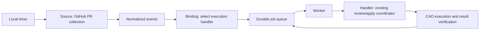

# Extensible Local GitHub Polling Automation

Status: **Proposed — design only**. The existing PR review/apply workflows are
available; the polling integration described here is not implemented.

## 1. Goal and Scope

Periodically query GitHub from a local host, persist changes as jobs, and execute
the existing CAO workflows. Keep collection and execution independently
extensible.

The initial integration connects open pull requests to the existing review/apply
coordinator and policy-authorized automatic push. Issue-driven development and
log monitoring are future extensions, not implementation targets for this design.

Operate on one Linux host without an inbound endpoint. This Git repository
remains the source of truth, and `manifest.json` remains the sole inventory of
deployed Workflow/Profile resources.

## 2. Components and Extension Interfaces

| Component | Responsibility | Initial implementation |
| --- | --- | --- |
| Source | Collect external state and produce change events | `github_pull_requests` |
| Binding | Connect an event kind to a handler and operator policy | PR revision changes to `pr_review_apply` |
| Job store | Persist deduplication keys, pending jobs, attempts, and recovery metadata | SQLite |
| Worker | Claim jobs, execute handlers, reconcile interrupted execution, and record results | One active job globally |
| Handler | Adapt a job to an existing workflow execution contract | Existing review/apply coordinator |

### Source Contract

`collect(context) -> events, checkpoint`

A Source collects data and returns normalized events and its collection
checkpoint. Persist the checkpoint, cached responses, and resulting jobs in one
transaction so a crash cannot advance collection state while losing work.

The normalized Event contains:

- `source_id`: the configured Source instance.
- `kind`: the event kind used for routing.
- `subject`: the external resource identity.
- `revision`: the resource version that the job must process.
- `observed_at`: the observation timestamp.
- `data`: bounded metadata needed by the handler; no credentials.

For a pull request, the subject is repository plus PR number, and the revision
contains both HEAD and base SHA.

### Handler Contract

`execute(job, context) -> result`

A Handler returns a processing state, CAO run IDs, recovery-state location, and
verified output identifiers. The execution context supplies trusted configuration
and access to the job store. Source collection does not execute workflows.

Jobs use `queued`, `running`, and `reconciling` while active, and `completed`,
`skipped`, `superseded`, `failed`, or `blocked` for recorded outcomes. Attempts are
retained separately so an operator retry does not erase execution history.

Register Sources and Handlers through repository-managed code. Configuration and
GitHub content cannot supply arbitrary executable commands or module paths.
Bindings are connection configuration, not a second Workflow/Profile inventory.

Future Issue collection, log monitoring, and Issue development adapters should
reuse the event contract, job store, Worker, and operating commands. Do not add
placeholder implementations for those features in the initial integration.

### Relationship to the independent workflow designs

The [MCP Exception Issue Workflow](MCP-EXCEPTION-ISSUE-DESIGN.md) and
[GitHub Issue Fix Workflow](GITHUB-ISSUE-FIX-DESIGN.md) remain separately
installable and runnable. Their standalone launchers do not require this polling
integration. Implementing either workflow does not enable an automatic Issue-fix
Binding or make an exception Issue trigger remediation.

The polling job store owns event observations, dispatch deduplication, job
claims, attempts, and assigned execution IDs. A Handler's execution journal owns
its CAO submission/result identities and workflow recovery state. The workflow
owns its candidate, validation, and external publication records. A job points
to that journal; the Worker reconciles it rather than independently recreating
workflow side effects.

For a future MCP integration, a registered monitor-tick Source emits bounded
repository/monitor/time-bucket metadata, and a Handler invokes the incremental
exception workflow. The workflow remains the sole owner of MCP ingestion
cursors and its incident queue; the Source checkpoint records tick observation
only. Pending ticks for the same monitor may be coalesced before dispatch because
the workflow collects from its own durable ingestion checkpoint. The Handler
must reconcile an in-flight execution before dispatching another tick. Actual
log acquisition always occurs through the workflow's MCP adapter.

A future Issue-fix Handler accepts an explicitly submitted Issue selection and
invokes the independent fix launcher. Automatic Issue collection-to-fix routing
is not enabled by this design. Enabling a polling Binding for a monitor replaces
that monitor's standalone cron trigger; never run both automatic dispatch paths.
The default MCP monitor interval remains five minutes, independently of the
initial PR Source's three-minute interval. Status must distinguish tick collection
health from the actual MCP ingestion lag; queued ticks do not establish that logs
have been collected. These adapter contracts are future extension boundaries,
not additions to the initial PR-only implementation target.

## 3. GitHub Collection and PR Execution

### Collection and Deduplication

The default collection interval is three minutes. Query all pages of open PRs
using stable ordering. Store an ETag and cached response per page, make conditional
requests for each page, and reuse cached data on `304 Not Modified`. A `304` on
one page does not authorize skipping the remaining pages. Respect rate-limit
reset times and `Retry-After`; back off on transient failures. Follow
[GitHub REST API best practices](https://docs.github.com/en/rest/using-the-rest-api/best-practices-for-using-the-rest-api).

Inspect existing open PRs on the first collection. Exclude drafts, forks, and
branches outside the configured push policy. Existing runtime publication gates
remain authoritative for branch protection and other push restrictions.

Use repository, PR number, HEAD/base SHA, Binding identity, workflow versions,
dependency-resource digest, and operator-policy digest as the job identity.
Changes to titles or comments alone do not rerun the same code revision.
Enforce uniqueness in the job store.

Freeze the effective Binding configuration, the selected policy's bytes/digest,
and the resource identity of the Handler's actual dependency set when persisting
the job. Resource identity includes workflow names/versions and source hashes,
associated profile hashes, and named Codex configuration hashes. Do not include
unrelated manifest entries. Store any policy snapshot in operator-owned private
state, with credential references only; never accept it from GitHub content.

### Execution and Recovery

Immediately before execution, refetch the PR and compare its state, HEAD/base,
effective Binding, policy digest, and dependency resource identity to the frozen
job. A changed snapshot/configuration records the queued job as `superseded`;
collection creates a distinct job for the new identity. A disallowed or closed
PR is skipped. Never execute new policy or workflow bytes under an old job key.
Existing HEAD/base checks continue to protect execution already in progress.

Extend the existing coordinator with optional `--chain-id`,
`--expected-head-sha`, `--expected-base-sha`, `--expected-policy-digest`, and
`--expected-resource-digest` inputs, and forward these and `--state-root` through
its launch entry point. The coordinator verifies these expectations at admission
and forwards policy/resource expectations to child workflows for their own
admission and pre-publication checks. Use the frozen private policy snapshot for
execution; recheck the currently authorized policy before new writes. Changes
stop publication rather than silently changing the execution contract. Preserve
existing manual defaults and the 32-character hexadecimal chain-ID format.

Narrow the existing coordinator's version comparison to `github-pr-review`,
`github-pr-apply`, and their actual profiles/Codex configurations. Its current
all-manifest comparison must be changed as part of implementation: registering
an unrelated workflow must not invalidate an existing PR chain. A relevant
workflow/profile/configuration change still rejects new execution steps. Preserve
remote-outcome reconciliation with frozen state even when configuration changes
block further writes.

Before launching the coordinator, persist its assigned chain ID and expected
state-file location. Store chain state under the persistent automation state
root, rather than relying on temporary-directory retention. Never overwrite an
existing chain state with a new execution.

After a restart, inspect the retained state and CAO run IDs and continue the same
execution. The existing coordinator's same-ID submission and resume behavior
remains the execution boundary. An ambiguous transport failure must not allocate
a new run ID. Keep unresolved execution in `reconciling` until its result can be
verified. Missing retained evidence requiring manual reconciliation produces a
`blocked` outcome.

Do not automatically rerun terminal workflow failures, partial application,
validation failures, or policy violations. An operator `retry` first checks the
previous execution and possible push outcome, then creates a new recorded
attempt when safe.

### Preventing Automatic Push Loops

Associate each successful push SHA with its verified CAO result. Record that
output HEAD as handled for the same base SHA, workflow versions, dependency
resource digest, Binding, and policy. Supersede any pending follow-up job for
that exact output revision.

A later user commit or base change creates a new revision eligible for processing.
Workflow, relevant resource, or policy changes also produce a distinct job
identity. Bot author names or commit-message markers alone cannot authorize
skipping a job; require retained execution evidence. If evidence is insufficient,
stop for reconciliation.

Preserve named read-only Codex profiles, deterministic file and GitHub writes,
isolated validation, protected-branch restrictions, and the existing concurrent
push defense. Never automatically approve or merge a PR.

## 4. Configuration, Operations, and Deployment

Operator configuration contains `schema_version`, a persistent absolute
`state_root`, Source definitions, and Binding definitions. Keep Source collection
options separate from Handler policy options. A Binding selects a registered
Handler and supplies its operator-policy path.

Store production configuration and state outside the checkout. Require an
operator-owned state directory with mode `0700` and state files with mode `0600`.
Configuration contains repository identifiers and policy paths, not credentials.
Use the existing `gh` authentication of the CAO service account. CAO's constructed
workflow environment does not forward `GH_TOKEN`, so setting that variable only
on the launcher is insufficient.

A systemd user timer runs a short collection process every three minutes. A
separate Worker service handles long executions. Collection continues while a
workflow is running. Enforce a single Worker instance and atomic job claims.
Provide repository-managed service/timer templates and operating instructions.

The operating CLI provides:

| Command | Behavior |
| --- | --- |
| `doctor` | Check configuration, authentication, owned/current deployments, CAO connectivity, and execution prerequisites |
| `poll` | Collect PR state and persist eligible jobs |
| `poll --dry-run` | Display proposed jobs without launching CAO or changing durable state |
| `worker` | Execute and reconcile queued jobs |
| `status --json` | Report Source health, collection times, queue state, run IDs, and outcomes |
| `retry JOB_ID` | Reconcile the previous attempt before explicitly creating a new attempt |

Operating logs contain metadata and failure reasons, without tokens or raw PR
content. Run collection, the Worker, and CAO under the same intended non-root
account with consistent filesystem and authentication access.

Reuse existing install/update ownership checks for CAO resources. Do not replace
unmanaged or modified deployments. Update README and operations documentation
with the connection setup, recovery procedures, and service lifecycle. For each
enabled repository, use this integration as the single automatic execution path;
avoid overlapping automatic triggers for the same PR.

## 5. Validation and Defaults

Test the following scenarios:

- Multiple pages, mixed `200`/`304` responses, PR closure/draft changes, transient
  API failures, and rate limits.
- Repeated observation of the same HEAD/base, workflow/policy changes, stale
  pending jobs, and duplicate Worker startup.
- Crashes after job persistence, after CAO submission before acknowledgement,
  and after successful push before local result persistence.
- Binding/policy/resource changes while a job is queued or running, frozen job
  expectation propagation, and unrelated workflow registration during PR resume.
- Stale HEAD/base, failed or partial application, automatic-push loop prevention,
  and forged commit markers without retained execution evidence.
- A test Source and Handler that integrate without changes to the queue or
  Worker implementation.
- Existing manual execution compatibility and ownership-checked deployment.
- Future-adapter contract tests for exclusive trigger ownership, monitor-tick
  coalescing, actual ingestion lag reporting, and execution-journal reconciliation;
  do not implement the future production adapters in the initial PR integration.

Run `make validate`, `make test`, and an isolated CAO installation cycle for
implementation changes. Separately validate actual collection, model review,
GitHub publication, correction, and push against an operator-configured test PR.
Local tests do not establish live-provider or GitHub publication success.

Defaults:

- Collection interval: three minutes.
- Global Worker concurrency: one active job.
- Apply mode: policy-authorized `push` for this automation Binding.
- Initial collection: inspect existing eligible open PRs.
- Terminal failure retries: explicit operator action only.
- Out of scope: automatic approval/merge and implementation of Issue development
  or log-monitoring workflows.
