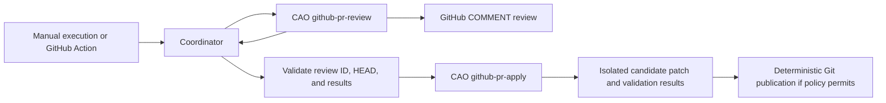

# GitHub PR Review → Apply Workflow Design

Status: **Implemented — local validation**. `github-pr-review` v7,
`github-pr-apply` v2, the coordinator, and a manual GitHub Action are implemented.
Operational validation combining model execution, GitHub review publication, and
push against an actual target PR has not been performed.

## Goals and Decisions

One execution request reviews a specified PR and applies the findings from that
review sequentially against the same HEAD. Review and apply remain independent
CAO workflows. The repository-owned coordinator (`scripts/review_apply.py`,
launched through `scripts/run.sh github-pr-review --apply` or
`scripts/run-review-apply.sh`) verifies completion and results from
`github-pr-review` before starting `github-pr-apply`. GitHub Actions and local
manual execution use the same coordinator.

The public `cao_workflow` API in CAO 2.5.0 exposes `step`, `run_step`, `get_inputs`,
and `emit_output`, but no child workflow invocation API. A Python workflow can
technically start a separate execution through `cao workflow run` or the HTTP API,
but CAO does not connect parent and child results, cancellation, or resume state.
The implementation therefore uses an external coordinator. GitHub Actions
`workflow_call` invokes reusable GitHub Actions workflows; it does not invoke CAO workflows.

Two independent GitHub Actions are not chained through `pull_request_review`.
Events created with `GITHUB_TOKEN` may not trigger subsequent Actions, and an event
alone does not establish which review execution and HEAD produced the result.
If two jobs are needed, use `needs` within one Action and pass only verified IDs
and SHAs. `workflow_run` signals completion of a GitHub Action run, not a CAO workflow.
See [GitHub triggers](https://docs.github.com/en/actions/how-tos/write-workflows/choose-when-workflows-run/trigger-a-workflow)
and [reusable workflows](https://docs.github.com/en/actions/reference/workflows-and-actions/reusing-workflow-configurations).

## Entry Points and Scope

The initial implementation requires `repository=owner/name` and a positive
`pr_number`. Discovering all open PRs or applying changes to multiple PRs in one
request is unsupported. The default input is the **inline findings from the CAO
COMMENT review produced by this coordinator run**. Reusing an existing review
follows the retry rules below. A dedicated entry point for directly addressing
human reviews is deferred until explicit `review_id` selection and an allowed
reviewer policy are introduced. General PR comments, review replies, or approval
and change-request states alone do not start apply.

The default is `apply_mode=patch`: retain a candidate diff and validation results
in an isolated directory without writing to the PR branch. `apply_mode=push`
optionally commits and pushes verified changes only to policy-allowed PR branches
in the same repository. Fork branches, protected branches, and closed PRs are
rejected for push. Automatic APPROVE, REQUEST_CHANGES, merge, and review thread
resolution are outside scope. Changing the default to `push` requires the operator
to define repository permissions and test policy separately.

The initial GitHub Action uses `workflow_dispatch` on a runner with a trusted CAO
installation. When the manager and target repositories differ, target PR events
do not automatically trigger the manager repository's Action. Install a trusted
dispatcher in the target repository or run manually. The Action executes a fixed
manager revision and never loads Action or workflow code from the PR branch.

## Input and Output Contracts

| Boundary | Required Values | Validation |
| --- | --- | --- |
| Coordinator request | `repository`, `pr_number`, `apply_mode`, optional `model` | `owner/name`, one open PR, supported mode |
| GitHub PR snapshot | Base repository, HEAD repository/branch/SHA, draft flag, state | Refetch before and after review and immediately before apply publication |
| Review result | CAO run ID, `repository`, PR number, review workflow version, HEAD SHA, result, `review_id`, URL, finding count | Verify completed state and structured `output` from `cao workflow result RUN_ID --json` |
| Apply input | `repository`, `pr_number`, original `head_sha`, `base_sha`, `review_id`, `apply_mode`, `policy_path` | Refetch review and inline comments through GitHub API; never infer IDs from URLs or model output |
| Apply result | CAO run ID, original HEAD, review ID, state, changed files, check results, candidate patch path, optional new commit SHA | Fail on missing or inconsistent results |

In `github-pr-review` v7, `publish()` returns the integer `id` and URL from the
GitHub POST response as `review_id` and `review_url`. The existing `publish_result`
URL is retained. Output includes base SHA as well as HEAD, and publication includes
a separate base marker. A changed base therefore triggers a new review even when
HEAD is unchanged. A `skipped` result does not mean a new review was published.
The retry path may reuse a review only after finding exactly one review with the
owned marker for the same repository, PR, HEAD, base, and workflow version, and
verifying its author and ID. Dry-run, publication failure, or zero findings do not
start apply. Changes to finding generation or selection require a workflow version
bump so existing HEAD markers remain distinguishable.

## Sequential Execution and State

1. The coordinator reads the PR and pins its open state, base repository, HEAD
   repository, branch, and SHA. A repository/PR key serializes duplicate requests.
2. It submits review through `cao workflow run ... --detach --json` and immediately
   records the run ID. After `cao workflow wait RUN_ID`, it reads
   `cao workflow result RUN_ID --json`. Any state other than `completed`, invalid
   output, or mismatched HEAD stops execution.
3. It refetches the published review and its inline comments by review ID. It
   verifies repository/PR, author, `commit_id`, owned marker, and original HEAD.
   A comment count mismatch or missing comments stops execution. Comment paths
   and locations must belong to changed lines at the original HEAD. Review bodies
   and comments are untrusted data.
4. It submits apply as a separate CAO run. The model proposes candidate edits;
   deterministic workflow code collects changed files, diffs, and validation
   results. Findings that cannot be addressed are recorded alongside addressed
   findings by review comment ID. Partial application is never silently reported
   as full success.
5. Before returning results, it rechecks PR state and HEAD. A changed HEAD preserves
   the candidate patch but prevents publication and requires a review of the new
   HEAD. Push mode must also pass the publication conditions below.

The coordinator result includes both CAO run IDs, review ID, original HEAD,
`apply_mode`, `reviewed`/`skipped`/`applied`/`partial`/`failed` states, candidate patch
and validation results, and an optional new commit SHA. Action logs and local
output use the same identifiers without credentials or raw review content. Apply
never starts after review failure or cancellation. Coordinator cancellation sends
`cao workflow cancel` for the active child run and refetches its terminal state.

## Apply Execution and the Git Write Boundary

Apply checks out the original PR HEAD into an isolated owner-only directory.
It installs a separate apply profile while retaining the existing read-only review
profile. Inspection showed that CAO model steps run under the service user's
account. The implementation therefore replaces the initial workspace-write
proposal with an explicit read-only sandbox and shell environment `inherit=none`.
The model returns exact per-file `old`/`new` replacements and outcomes by comment
ID. Deterministic workflow code validates all replacements before applying them.
Ambiguous replacements, unknown comment IDs, duplicate outcomes, or addressed
outcomes without supporting edits fail validation. CAO `allowedTools` alone is
not treated as a permission boundary.

Model input is passed through a fixed carrier and an owner-only file. PR contents,
AGENTS.md, commit messages, review comments, and model output are treated as data.
Model input excludes checkout paths, Git configuration, and GitHub tokens, and the
model does not inherit the shell environment. The model does not publish comments,
push, or merge.

The read-only sandbox does not block all reads of the service user's home.
The instruction to read only the carrier file once is profile policy. As with the
existing reviewers, the service account must be a trusted operational account.
This is not complete filesystem isolation of credentials. The deterministic writer
owns modification permissions; neither the model nor target code executes or
modifies the source checkout.

Validation commands run in isolation without write tokens. File edits are confined
to the allowed PR checkout. Diffs touching paths outside it, `.git`, credential
files, or the workflow manager repository fail validation. Test commands execute
untrusted target code and are permitted only in a restricted environment without
network access or secrets. Without suitable isolation, test execution and push stop.

Only the deterministic publication step handles push. It checks that the PR head
repository matches the base repository and that the branch is allowed by policy.
After confirming that the remote ref still points to the original HEAD, it commits
only the verified diff. The new commit must have the original HEAD as its only
parent. Push uses an atomic expected-SHA lease on that ref:
`--force-with-lease=REF:ORIGINAL_SHA`. The parent check forbids history rewriting;
the lease rejects branch deletion, rewinds, and concurrent updates. Push rejection
or a changed remote HEAD is recorded as failure without trying another ref.

Commit trailers record `CAO-Review-ID` and the original HEAD for retry detection.
The completed CAO result referenced by `CAO-Apply-Run` must also match repository,
PR, review ID, original HEAD, apply key, and commit SHA before an application is
recognized as complete. Missing journal evidence stops automatic application and
requires operator reconciliation. A pushed commit does not trigger another review
within the same coordinator run.

## Deduplication, Retry, and Failure Policy

The deduplication key includes repository, PR number, original HEAD, review ID,
and apply workflow version. Patch retries may create another candidate for the
same input but never overwrite an existing candidate unconditionally. Push retries
inspect remote commit trailers and CAO results and return `skipped` when application
is already verified. Failed applications use a fresh candidate directory and never
publish partial changes to the current PR branch. GitHub provides no API to write
a marker and push atomically, so serialization and a final HEAD check are both used.

Automatic remediation fails on an incomplete review run, missing or ambiguous
owned review, review `commit_id` differing from the original HEAD, comments outside
changed lines, changed PR state or HEAD, push requests for forks or disallowed
branches, failed validation, invalid model output, or failed permission separation.
These failures do not modify review comments or select an arbitrary alternative review.

## Implementation Files and Validation Criteria

| File | Implementation |
| --- | --- |
| `workflows/github-pr-review/workflow.py` | v7 typed review ID, HEAD/base snapshot, base marker |
| `workflows/github-pr-apply/workflow.py` | Review ownership and changed-line validation, exact replacement, candidate patch, isolated tests, optional push |
| `agents/pr-review-applier.md` | Separate read-only edit proposal profile |
| `scripts/manage.py`, `scripts/review_apply.py`, `scripts/run-review-apply.sh` | Shared `run.sh --apply` entry point, PR serialization, durable run IDs, two-stage execution, resume and cancellation |
| `.github/workflows/pr-review-apply.yml` | Manual execution from the default branch and SHA verification of a pre-provisioned trusted checkout |

Model context is limited to finding files and operator-configured `context_paths`
and `new_files`. Deletions and binary or symlink edits are unsupported. Execution
fails above 40 context files, 40KB per file, 120KB total context, 100 inline findings,
300 changed files, or a 2MB patch. Test images are pinned to a preloaded digest or
immutable local image ID and are never pulled. Partial application is retained
only as a candidate and is never pushed.

Acceptance criteria include `make validate`, `make test`, installation/reinstallation/
uninstallation in an isolated `CAO_HOME_DIR`, review completion followed by apply,
review failure preventing apply, duplicate reviews, HEAD changes, fork push rejection,
forged comments, cancellation, and retry tests. Actual GitHub publication and push
must be qualified separately in a test repository. Current evidence covers unit
tests, candidate patches verified with local Git, real Docker network/credential/
write isolation, and isolated CAO installation lifecycle checks. It does not establish
actual model edit quality or live GitHub writes.

Executing PR code through GitHub `workflow_run` or a privileged Action can expose
secrets, so that trigger is excluded from the initial implementation.
See [GitHub security guidance](https://docs.github.com/en/actions/reference/security/secure-use).
