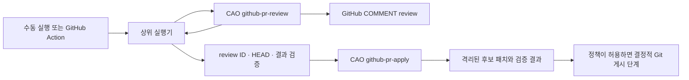

# GitHub PR review → apply 워크플로 설계

상태: **Proposed**. 이 문서는 구현 계약이다. 현재 저장소에는 `github-pr-review`만
구현되어 있으며, apply 워크플로와 연결 실행기는 아직 없다.

## 목표와 결정

하나의 실행 요청으로 지정한 PR을 리뷰하고, 그 실행이 생성한 리뷰의 조치 사항을
같은 HEAD에서 순서대로 적용한다. 리뷰와 적용은 각각 독립적인 CAO 워크플로로
유지한다. 저장소가 소유하는 상위 실행기(`scripts/run-review-apply.sh` 예정)가
`github-pr-review` 완료와 결과를 확인한 뒤 `github-pr-apply`를 시작한다.
GitHub Action은 이 상위 실행기를 호출하는 진입점이다. 로컬 수동 실행도 같은
실행기를 사용한다.

CAO 2.5.0의 `cao_workflow` 공개 API에는 `step`, `run_step`, `get_inputs`,
`emit_output`이 있고 자식 워크플로 호출 API는 없다. Python 워크플로에서
`cao workflow run` 또는 HTTP API를 호출하면 기술적으로 별도 실행을 시작할 수
있지만, 부모와 자식의 결과·취소·재개를 CAO가 연결하지 않는다. 따라서 다른
CAO 워크플로를 내부에서 호출하지 않는다. GitHub Actions의 `workflow_call`은
GitHub Actions 재사용 워크플로를 호출하는 기능이며 CAO 호출 기능은 아니다.

두 개의 독립 GitHub Action을 `pull_request_review` 이벤트로 연결하지 않는다.
`GITHUB_TOKEN`이 생성한 이벤트는 후속 Action을 시작하지 않을 수 있고, 이벤트만
보면 어느 review 실행·HEAD의 결과인지 확정할 수 없다. GitHub Action을 두 job으로
나눠야 한다면 하나의 Action에서 `needs`로 순서를 지정하고 검증된 ID와 SHA만
전달한다. `workflow_run`은 GitHub Action 실행 완료 이벤트이지 CAO 워크플로
완료 이벤트가 아니다. [GitHub 트리거](https://docs.github.com/en/actions/how-tos/write-workflows/choose-when-workflows-run/trigger-a-workflow),
[재사용 워크플로](https://docs.github.com/en/actions/reference/workflows-and-actions/reusing-workflow-configurations).

## 진입점과 적용 범위

첫 구현의 입력은 `repository=owner/name`과 양수 `pr_number`를 필수로 한다.
열린 PR 전체 검색이나 여러 PR 동시 적용은 허용하지 않는다. 기본 적용 대상은
**이번 상위 실행에서 생성한 CAO COMMENT review의 inline finding**이다. 이미
게시된 리뷰를 이용한 재실행은 아래 재시도 규칙으로만 처리한다. 사람의 리뷰를
직접 조치하는 별도 진입점은 이후에 명시적 `review_id`와 허용된 리뷰어 정책을
추가할 때 구현한다. 일반 PR 댓글, 리뷰 답글, 승인/변경 요청 상태만으로는
적용을 시작하지 않는다.

`apply_mode=patch`를 기본값으로 한다. 격리 작업 디렉터리에 후보 diff와 검증
결과를 남기되 PR 브랜치에 쓰지 않는다. `apply_mode=push`는 정책에서 허용한
동일 저장소의 PR 브랜치에만 검증된 변경을 커밋·푸시하는 선택 모드다. 포크
브랜치, 보호 브랜치, 닫힌 PR은 이 모드에서 거부한다. 자동 APPROVE,
REQUEST_CHANGES, merge, 리뷰 스레드 해결은 범위 밖이다. 기본 모드를 `push`로
바꾸려면 운영자가 대상 저장소의 권한과 테스트 정책을 별도로 정해야 한다.

GitHub Action의 첫 제공 형태는 `workflow_dispatch`와 신뢰된 CAO 실행기가 있는
runner다. 관리 저장소와 대상 저장소가 다르면 대상 저장소의 PR 이벤트는
관리 저장소의 Action을 자동으로 시작하지 않으므로, 대상에 신뢰된 dispatcher를
설치하거나 수동 실행한다. Action은 관리 저장소의 고정된 코드 버전을 실행하고
PR 브랜치에서 Action/워크플로 코드를 로드하지 않는다.

## 입력·출력 계약

| 경계 | 필수 값 | 확인 규칙 |
| --- | --- | --- |
| 상위 실행 요청 | `repository`, `pr_number`, `apply_mode`, 선택 `model` | `owner/name`, 열린 단일 PR, 허용된 모드 |
| GitHub PR 스냅샷 | base 저장소, HEAD 저장소·브랜치·SHA, draft, 상태 | review 전후와 apply 게시 직전에 재조회 |
| review 결과 | CAO run ID, `repository`, PR 번호, review workflow 버전, HEAD SHA, 결과, `review_id`, URL, finding 수 | `cao workflow result RUN_ID --json`의 완료 상태와 구조화된 `output` 검증 |
| apply 입력 | `repository`, `pr_number`, 원래 `head_sha`, `review_id`, `apply_mode` | GitHub API에서 리뷰와 inline 댓글을 다시 조회; URL이나 모델 출력에서 ID를 추측하지 않음 |
| apply 결과 | CAO run ID, 원래 HEAD, review ID, 상태, 변경 파일, 검사 결과, 후보 패치 위치, 선택적 새 commit SHA | 결과가 빠지거나 모순되면 실패 처리 |

현재 `github-pr-review`의 `publish()`는 URL 문자열만 반환하고 `process_pr()`는
그 문자열을 `publish_result`로 출력한다. 구현 시 GitHub review POST 응답의
정수 `id`와 URL을 구조화해 반환해야 한다. 결과가 `skipped`이면 이번에 새
review가 게시된 것으로 간주하지 않는다. 같은 repository·PR·HEAD·workflow
버전의 소유 marker가 붙은 review를 조회해 작성자와 ID가 정확히 하나인지
확인한 경우에만 재시도 경로에서 사용한다. `dry-run`, 게시 실패, finding 0개는
apply를 시작하지 않는다. review의 finding 생성·선별 규칙을 변경하면
workflow 버전을 올려 기존 HEAD marker와 구분한다.

## 순차 실행과 상태

1. 상위 실행기는 PR을 읽고 열린 상태, base 저장소, HEAD 저장소·브랜치·SHA를
   고정한다. 같은 PR의 중복 실행은 저장소+PR 키로 직렬화한다.
2. `cao workflow run ... --detach --json`으로 review를 제출하고 run ID를 즉시
   기록한다. `cao workflow wait RUN_ID` 뒤 `cao workflow result RUN_ID --json`을
   읽는다. `completed` 이외 상태, 비정상 output, 불일치 HEAD는 중단한다.
3. 게시된 review ID로 review와 그 review의 inline 댓글을 API에서 다시 읽는다.
   repository/PR, 작성자, `commit_id`, 소유 marker, 원래 HEAD를 검증한다.
   댓글 수와 finding 수가 다르거나 댓글이 없으면 중단한다. 댓글의 path와
   위치는 원래 HEAD의 변경 줄에 속해야 한다. 리뷰 본문과 댓글은 모두
   신뢰할 수 없는 데이터다.
4. apply를 별도 CAO run으로 제출한다. 모델은 후보 변경만 만들고, 결정적
   워크플로 코드가 변경 파일·diff·검증 결과를 수집한다. 자동으로 모든 finding을
   고칠 수 없으면 조치한 항목과 미조치 항목을 review comment ID별로 기록한다.
   조용히 성공으로 처리하지 않는다.
5. 결과를 출력하기 전 PR 상태와 HEAD를 다시 확인한다. HEAD가 달라졌으면
   후보 패치는 보존하되 게시를 막고 새 HEAD의 리뷰를 요구한다. `push` 모드는
   아래 게시 조건을 추가로 통과해야 한다.

상위 실행 결과에는 두 CAO run ID, review ID, 원래 HEAD, `apply_mode`,
`reviewed`/`skipped`/`applied`/`partial`/`failed` 상태, 후보 패치와 검증 결과,
선택적 새 commit SHA를 포함한다. Action 로그와 로컬 출력에 동일한 식별자를
남기며 자격 증명과 리뷰 원문은 남기지 않는다. review 실패나 취소 이후에는
apply를 시작하지 않는다. 상위 실행 취소 시 활성 자식 run ID에 대해
`cao workflow cancel`을 요청하고 실제 종결 상태를 재조회한다.

## apply 실행 및 Git 쓰기 경계

apply는 PR의 원래 HEAD를 격리된 소유자 전용 작업 디렉터리에 checkout한다.
기존 review의 read-only Codex profile을 변경하지 않고, 별도 적용 profile을
설치한다. 이 profile에는 명시적 workspace-write sandbox와 승인 정책을
설정한다. CAO의 `allowedTools`만으로 권한을 제한했다고 간주하지 않는다.
모델 입력은 고정 형식 carrier와 소유자 전용 파일로 전달한다. PR 내용,
AGENTS.md, 커밋 메시지, 리뷰 댓글, 모델 출력은 모두 데이터로 취급한다.

모델 단계에는 GitHub 쓰기 토큰, Git credential helper, 게시 API 권한을
제공하지 않는다. 모델은 GitHub에 댓글을 달거나 push/merge하지 않는다.
검증 명령도 쓰기 토큰이 없는 격리 환경에서 실행한다. 실제 코드 수정은
허용된 PR checkout 안으로 제한하고, diff가 그 checkout 밖·`.git`·자격 증명
파일·워크플로 관리 저장소를 건드리면 실패한다. 테스트 명령은 대상 저장소의
신뢰할 수 없는 코드이므로 네트워크·비밀 정보 없이 제한된 실행 환경에서만
허용한다. 적절한 격리 환경이 없으면 테스트 실행이나 `push`를 중단한다.

`push` 모드는 결정적 게시 단계만 수행한다. PR head 저장소가 base 저장소와
같고 정책 허용 브랜치인지 검사한다. 원격 ref가 원래 HEAD인지 마지막으로
확인한 후, 검증된 diff만 커밋하고 해당 head ref에 일반 push한다. force push는
허용하지 않는다. push 거부나 원격 HEAD 변경은 실패로 기록하며 다른 ref를
시도하지 않는다. `CAO-Review-ID`와 원래 HEAD를 커밋 trailer에 기록해 재시도
시 이미 조치한 리뷰를 판별한다. 이 commit이 PR을 갱신하더라도 이번 상위
실행에서 자동으로 다시 review하지 않는다.

## 중복·재시도·실패 정책

중복 키는 `repository + PR 번호 + 원래 HEAD + review ID + apply workflow 버전`이다.
`patch` 재실행은 동일 입력으로 후보를 다시 만들 수 있으나 기존 후보를
무조건 덮어쓰지 않는다. `push` 재실행은 원격 commit trailer와 CAO 결과를
조회해 이미 적용된 경우 `skipped`로 마친다. 적용 도중 실패한 경우 새 후보
작업 디렉터리를 사용하고, 부분 변경을 현재 PR 브랜치에 게시하지 않는다.
GitHub에는 marker와 push를 원자적으로 함께 기록할 API가 없으므로 직렬화와
게시 직전 HEAD 재검사를 모두 사용한다.

다음 조건은 자동 조치 실패다: review run 미완료, 찾을 수 없는/여러 개의
소유 review, 원래 HEAD와 다른 review `commit_id`, 변경 줄이 아닌 댓글,
PR 상태·HEAD 변경, 포크 또는 비허용 브랜치에 대한 push 요청, 검증 실패,
모델 출력 형식 오류, 권한 분리 실패. 이 경우 review 댓글을 수정하거나
다른 리뷰를 임의로 선택하지 않는다.

## 구현 순서와 검증 기준

1. `github-pr-review`에 typed review ID 출력과 결과 검증 테스트를 추가한다.
   리뷰 의미가 바뀌는 변경에는 manifest의 workflow 버전도 올린다.
2. `github-pr-apply`와 별도 적용 profile을 manifest에 등록한다. isolated
   checkout, 리뷰 귀속·HEAD·changed-line 검사, 후보 diff 수집을 구현한다.
3. 상위 실행기에 순차 실행, 명시적 run ID, 재시도·취소 상태 처리를 구현한다.
   첫 단계는 `apply_mode=patch`로 완료한다.
4. 자격 증명 분리·테스트 격리·브랜치 정책이 검증된 뒤 선택적 `push` 모드와
   수동 GitHub Action 진입점을 추가한다.

`make validate`와 `make test`, 격리된 `CAO_HOME_DIR` 설치/재설치/삭제,
review 완료→apply 시작, review 실패→apply 미시작, 중복 review, HEAD 변경,
포크 push 거부, 댓글 위조, 취소·재시도 테스트가 수용 기준이다. 실제 GitHub
게시·push는 별도 테스트 저장소에서 검증한다. README와 운영 문서는 각 단계의
실제 동작이 생길 때 갱신한다.

GitHub `workflow_run` 또는 권한 있는 Action에서 PR 코드를 실행하면 비밀 정보가
노출될 수 있으므로 해당 트리거를 첫 구현에 사용하지 않는다.
[GitHub 보안 지침](https://docs.github.com/en/actions/reference/security/secure-use).
