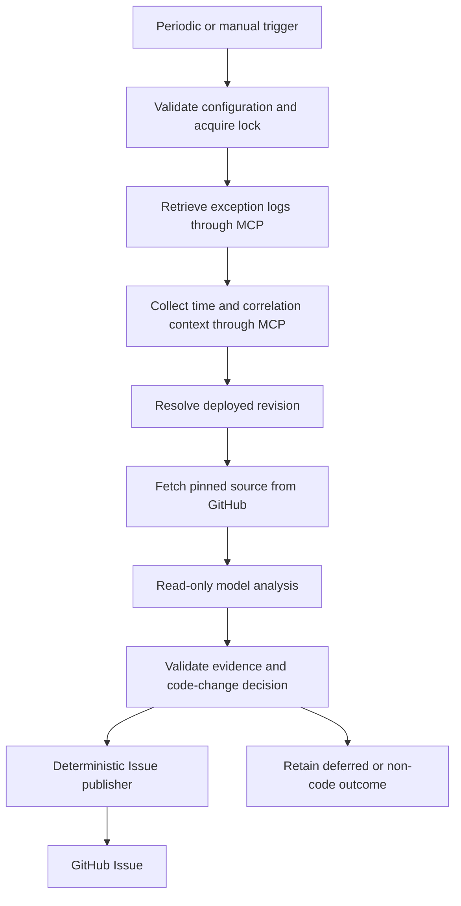

# MCP Exception Logs to GitHub Issue Workflow Design

Status: Proposed. This document defines a new workflow; it does not describe an
installed or implemented automation.

## Purpose and operating model

`mcp-exception-issue` retrieves exception logs from configured MCP servers,
collects additional logs around each exception's occurrence time, analyzes the
exact deployed source revision obtained from GitHub, and creates a GitHub Issue
when the evidence supports a code change.

All application, access, infrastructure, and other operational logs used as
evidence must originate from MCP queries. Source files must originate from
GitHub at a resolved commit SHA. Local log files, SSH, direct logging-backend
APIs, and existing workspace source checkouts are not acquisition sources.
Temporary storage of MCP-derived evidence and GitHub-derived source is allowed.

The workflow runs periodically or for an explicitly requested time range. It
does not invoke the remediation workflow. An Issue is the handoff artifact for
the independently executed [GitHub Issue Fix Workflow](GITHUB-ISSUE-FIX-DESIGN.md).



## CAO integration and execution

Use the inspected CAO 2.5.0 script-tier contract: a self-contained Python workflow
with static `WORKFLOW`, `VERSION`, and `INPUTS`, and the `cao_workflow` shim's
`get_inputs()`, `step()`, and `emit_output()` functions. The proposed initial
version is `v1`.

Register the workflow and its dedicated `exception-triager` profile in
`manifest.json`. Deploy through the existing ownership-checked management
scripts. CAO home remains a deployment target; this Git repository remains the
source of truth. The deployed script must not depend on imports from this
repository's checkout or CAO server internals.

The installed CAO scheduler launches agent sessions. Use an external cron entry
to invoke this workflow through the management launcher every five minutes.
The cron entry references an operator-controlled policy and the trusted manager
checkout. Extend the launcher with workflow-specific argument validation and
deployed-resource checks; preserve existing review/apply behavior.

Standalone cron owns automatic dispatch for a monitor. If the optional future
[polling integration](GITHUB-POLLING-AUTOMATION-DESIGN.md) is enabled for that
monitor, disable its cron entry and let the registered monitor-tick Handler call
the same launcher. The polling store owns dispatch jobs and attempts; this
workflow owns MCP ingestion checkpoints, incident processing, and publication.
It remains independently executable and does not enqueue an Issue-fix run.

Proposed launcher interfaces, available after implementation:

```bash
# Periodic incremental execution.
./scripts/run.sh mcp-exception-issue --repository owner/repo \
  --monitor production-api --policy /absolute/operator/monitor-policy.json

# Inspect a historical period without publishing.
./scripts/run.sh mcp-exception-issue --repository owner/repo \
  --monitor production-api --policy /absolute/operator/monitor-policy.json \
  --from 2026-10-01T00:00:00Z --until 2026-10-01T01:00:00Z --dry-run

# Reconcile or continue the previously recorded execution.
./scripts/run.sh mcp-exception-issue \
  --resume /absolute/operator/monitor-state/executions/EXECUTION.json
```

| Input | Requirement and behavior |
| --- | --- |
| `repository` | Required GitHub `owner/name`; must match the selected monitor configuration |
| `monitor_id` | Required identifier of an operator-configured monitoring scope |
| `policy_path` | Required absolute path to an operator-owned policy outside model workspaces |
| `since`, `until` | Optional explicit time range; both must be supplied together, with an explicit timezone |
| `publish_mode` | `issue` by default, or `dry-run` |

The launcher maps `--monitor` to `monitor_id`, `--from` to `since`, and `--dry-run`
to `publish_mode=dry-run`. Historical execution does not advance the incremental
monitor checkpoint. Dry-run also does not mutate the operational pending queue
or fingerprint publication state; its result artifacts are separate.

### Submission journal and resume interface

The launcher accepts optional `--state-root` on a new execution and `--resume`
on recovery. The default state root comes from operator policy and must be
persistent, private, and outside model workspaces. Resume uses recorded inputs;
repository, monitor, time range, policy, and publication-mode overrides are
rejected. Validate the journal's ownership, location, schema, and workflow name.

Before any CAO submission, assign a 32-character hexadecimal execution ID,
derive the explicit run ID, and atomically persist the journal with input,
policy, and dependency-resource digests. Print its path before submission.
Then invoke `cao workflow run` with that explicit run ID. The journal records
all submitted run IDs and their CAO results. The dependency set contains only
this workflow, its triager, and its named Codex configuration; unrelated
manifest additions do not invalidate recovery.

Pass the trusted execution-state path and expected policy/resource digests as
internal workflow inputs. Verify expectations before analysis and new GitHub
writes; changing the authorized policy or a relevant resource blocks further
execution. Preserve read-only reconciliation of prior outcomes even if those
checks block new writes.

The internal inputs are `execution_state_path` (string),
`expected_policy_digest` (string), `expected_resource_digest` (string), and
`recovery_only` (boolean, default false). Only the trusted launcher supplies them.
Recovery-only mode reads retained publication intents and never runs model steps.

On resume, query the recorded CAO run first. Wait for a live run. Resubmit the
same ID and frozen inputs only after a confirmed unknown-run response, never
after an ambiguous transport error. Failed/cancelled runs require the operator's
explicit CAO recovery decisions or a safely reconciled new attempt. A completed
run with unresolved publication may use a recovery-only CAO child, whose ID is
persisted before submission. That child only reconciles recorded side effects;
it does not recollect logs, rerun triage, or allocate a new incident episode.
Persist any explicit CAO recovery decisions before continuation. Missing
retained evidence yields `blocked` rather than an automatic fresh execution.

## Operator configuration and MCP adapter

The operator policy defines monitoring scopes, MCP connections, repository
bindings, deployment-revision resolution, budgets, credentials, and private
state/artifact locations. Validate its schema and ownership before connecting.
Use a regular, non-symlink file owned by the execution user with mode `0600`.

Each monitoring scope specifies:

- Service, environment, allowed log sources, and explicitly allowed related
  services. Bind each service's source to its configured GitHub repository.
- MCP transport, endpoint or trusted stdio argv, credential reference, allowed
  read tools, tool argument templates, and response field mappings.
- Timestamp format/timezone, stable record identity, pagination mapping, query
  completeness checks, and deployment SHA or version-field mapping.
- Optional operator-maintained deployment intervals mapping service,
  environment, and occurrence time to a GitHub commit or tag.
- Collection windows, record/byte budgets, source context restrictions, and
  private state/artifact locations.

Use the installed MCP Python SDK 1.30.0 APIs for stdio and Streamable HTTP.
Connection setup initializes the MCP session, lists tools, and verifies the
configured tools and required argument schemas. Tool selection is controlled
by the operator policy, rather than tool annotations or model suggestions.
No write tools are exposed to the model.

The adapter provides the following logical operations. These are internal
interfaces mapped to existing server tools, not required new MCP tool names.

| Operation | Inputs | Outputs |
| --- | --- | --- |
| Search exceptions | Scope, start/end, cursor | Records, next cursor, completeness metadata |
| Search context | Allowed scopes, start/end, correlation and instance filters, cursor | Records, next cursor, completeness metadata |
| Resolve revision | Service, environment, occurrence time | Commit/tag reference and provenance, or unresolved |

A normalized record contains `record_id`, `occurred_at`, `service`,
`environment`, and `message`, plus optional severity, stack trace, instance ID,
trace/request ID, and deployment revision. Preserve timestamp provenance and
normalize comparisons to UTC. Missing timezone information requires the
configured source timezone; do not guess it. A missing stable record ID may be
replaced with a deterministic hash of the normalized record and source identity.

Every evidence reference retains the server ID, tool name, effective query
scope/time range, record ID, and retrieval time. Normalize structured responses
or configured JSON text responses; reject ambiguous or malformed responses.
Handle both MCP tool-list pagination and the selected logging tool's own result
pagination. Repeated cursors, truncation, or unverifiable completeness must be
reported explicitly.

## Processing stages

### 1. Admission, locking, and incremental collection

Acquire a monitor lock keyed by repository and monitor ID. The initial release
assumes a single execution host with local locks and durable, owner-only state.
Multiple distributed workers are outside this release's concurrency contract.

Use one operator-configured shared SQLite monitor store on the host for ingestion
checkpoints, pending incidents, and publication records. It is outside model
workspaces, with a private directory and owner-only database/state files.
Execution-journal `--state-root` overrides do not relocate this shared store or
its locks. Persist each completed collection page/interval, its deduplicated
events, and its checkpoint in one transaction. Monitor locking serializes
collection for that monitor; publication uses a separate shared fingerprint lock.

For a new monitor, query the last 15 minutes ending at the stable collection
cutoff. The default cutoff is current time minus two minutes. Prefer an ingestion
cursor if the adapter supports one; otherwise use an event-time watermark with
a five-minute overlap. Deduplicate records across overlap and retries.

Group multiline stack traces into exception events using configured record
relationships and ordering. Do not combine unrelated events solely because
their timestamps are close. Persist discovered events in a durable pending
queue before advancing the collection checkpoint. A collection checkpoint
advances only across fully collected intervals/pages whose events are retained.
Failed analysis does not discard a queued event.

Logs arriving beyond the configured overlap need a historical backfill when no
ingestion cursor is available. Retention gaps and incomplete collection ranges
must be visible in the result, rather than reported as successful coverage.

### 2. Time-based context expansion

For an exception occurring at `t0`, begin with `[t0 - 5 minutes, t0 + 5 minutes]`.
Clip the end to the stable collection cutoff and record the actual queried
interval. Prioritize trace/request IDs, then instance identity and configured
related services. Fetch application, access, or infrastructure logs only from
the configured MCP sources.

The triager may return a structured request for additional evidence, specifying
the missing fact, allowed scope, correlation filters, and requested time range.
The deterministic workflow validates it and performs the MCP query. The model
cannot choose arbitrary servers, tool names, backend query expressions, or
credentials.

If evidence remains insufficient, expand to a 15-minute window on each side,
then a 60-minute window on each side. Allow at most two expansion rounds after
the initial context query. Stop expansion when evidence is sufficient. The
default context budget is 10,000 records or 5 MB per incident; hitting a budget
or an unrecoverably incomplete response returns the triage decision
`needs_context` and records the incident as `blocked`. If necessary post-event
evidence is not yet collectable, record `deferred` with an explicit
`next_retry_at` after that interval's collection cutoff. Do not run the model
again on identical insufficient evidence at every cron tick.

Only transient read failures and evidence expected to become collectable may
be retried automatically. Persist retry count, reason, last attempt, and next
eligible time. After the first processing attempt, allow at most three deferred
retries with five-, ten-, and twenty-minute backoff, honoring a later server
retry hint or known evidence-availability time. Continued insufficiency becomes
`blocked`. Expired logs, unresolved deployment identity requiring operator
configuration, authentication/tool-contract failures, and fixed budget limits
require explicit operator intervention. Process other eligible incidents while
one incident is deferred or blocked. An operator retry retains prior attempts
and requires a recorded corrective change or new evidence.

### 3. Deployed revision and source context

Resolve the source revision from MCP log/deployment metadata or the configured
deployment interval map. A tag must be resolved to a GitHub commit SHA and that
SHA retained for the analysis. Rolling deployments require the revision of the
affected instance or otherwise unambiguous evidence. Ambiguous deployment
identity returns `needs_context`.

Fetch source from the configured GitHub repository at that exact SHA into an
isolated temporary checkout. Gather the stack-trace locations, relevant callers,
and tests within configured context bounds. Validate every derived relative
path. Repository URLs and filesystem paths embedded in logs cannot override
the operator's repository mapping. Related service source, when needed, follows
the same pinned GitHub acquisition rule.

Use the existing bounded-context conventions: at most 40 source context files,
40 KB per file, and 120 KB per model input. Prepare bounded, redacted evidence
for the model; context omissions and unavailable source must remain explicit.

### 4. Read-only triage and decision gate

The dedicated triager uses a named read-only Codex profile with
`approval_policy=never` and no inherited credential environment. An
`allowedTools` list alone does not enforce this boundary in CAO 2.5.0.
Use shell-inert carrier tokens and mode-`0600` input files under a private
mode-`0700` carrier directory, following the existing workflow pattern.
Disable injected memory or ensure its injected block is empty.

Invoke model steps with stable incident/round step IDs and explicit
`recovery="manual"`. Freeze input digests so recovery cannot reuse analysis for
different evidence or source revisions. Delete carrier inputs after use.

The structured triage contract contains:

- `decision`: `code_change_required`, `non_code`, or `needs_context`.
- Summary and causal explanation, with references to supplied evidence IDs.
- Source locations at the pinned SHA, proposed fix direction, and regression
  verification scenarios when a code change is required.
- Structured additional-context requests when information is missing.

The publication gate verifies the output schema, evidence references, source
locations, and the required fix/verification explanation. Model confidence alone
does not authorize publication. Temporal proximity alone is not causal proof.
Infrastructure incidents, external failures, expected exceptions, and operator
configuration problems can produce `non_code` without creating a code Issue.

### 5. Deterministic Issue publication

Build a deterministic fingerprint from repository, service, environment,
deployed SHA, normalized root exception signature, application stack locations,
and analysis version. Remove request IDs, timestamps, and configured variable
message fragments from the signature; preserve distinctions between different
failure locations. Do not use a model-generated summary as the identity.

Publication records are shared by all monitors on the host. Acquire a
repository/fingerprint lock before selecting an occurrence episode or checking
GitHub, then reserve the repository/fingerprint/episode identity with a unique
constraint in the shared store. The lock remains held through POST/result
reconciliation and publication-state persistence. Monitor IDs are provenance,
not part of the deduplication identity: overlapping monitors must converge on
the same Issue. Historical runs use the same publication store and lock.

Under that lock, check GitHub for the configured publisher's Issue marker.
Reuse an open matching Issue and record its URL. For new events after a matching
Issue was closed, create a new episode linked to the previous Issue and persist
the selected identity before publication. Existing historical events do not
create new episodes merely because an Issue was later closed. An existing
unresolved publication reservation must be reconciled before another monitor
can attempt creation for that fingerprint/episode.

The deterministic Issue body includes:

- Observed behavior, service/environment, affected instance when known, and
  occurrence time with timezone.
- Deployed commit and immutable GitHub source permalinks.
- MCP query provenance, actual context coverage, and bounded redacted excerpts.
- Evidence-supported root-cause analysis, proposed change, and regression
  verification criteria.
- A machine-readable marker carrying the schema/workflow version, fingerprint,
  episode ID, monitor ID, service/environment, deployed SHA, and replay query
  descriptors. It contains no credentials or arbitrary executable commands.

Perform secret/PII redaction before model input and publication, and inspect
model output before rendering. Do not publish entire raw log streams. The
publisher verifies the typed GitHub Issue number and URL after creation.

Write a `pending_publish` record before the POST. If the response is lost or
ambiguous, reconcile by listing Issues and checking the exact marker and
publisher identity. Do not blindly repeat the POST. If reconciliation is
incomplete, retain a blocked publication record for operator reconciliation.

The intent retains the exact bounded, redacted Issue payload, its digest,
fingerprint/episode, and authorized publisher identity before POST. A
recovery-only child can verify a matching Issue or publish a confirmed unsubmitted
intent without reconstructing model analysis. An ambiguous prior POST is always
reconciled first; absence of sufficient remote evidence blocks a fresh POST.

## Results, retention, and failure handling

Emit workflow/version/run identity, repository/monitor, requested and collected
time ranges, checkpoint progress, and per-incident outcomes. Per-incident status
is `issue_created`, `issue_reused`, `non_code`, `deferred`, `blocked`, or `failed`.
Retain `needs_context` as the model's triage decision, separately from operational
retry disposition. Include the fingerprint, deployed SHA, Issue number/URL when
available, failed stage/reason, retry count, and `next_retry_at` for deferred work.
Ambiguous publication remains in reconciliation until verified or blocked;
never report it as confirmed publication failure or success without evidence.

Keep monitor checkpoints, event identities, pending work, publication records,
and bounded redacted results outside Git with owner-only permissions. Raw
evidence is transient; retained artifacts must identify their MCP provenance.
The consumer workflow re-queries MCP instead of treating saved Issue excerpts
or local artifacts as independently acquired logs.

Apply bounded retries to read requests and honor server retry/rate-limit hints.
Authentication failures, incompatible tool contracts, unresolved revisions,
retention gaps, and budget exhaustion prevent unsupported Issue creation.
Terminal model/validation failures are `failed` and require explicit operator
retry; retaining the incident does not make it automatically eligible again.
Cancellation releases the lock and leaves durable pending/publication state.
Run completion must be interpreted through the structured incident outcomes;
CAO script completion alone does not establish successful Issue publication.

## Validation and acceptance criteria

- Unit/fixture tests cover timestamp conversion, grouping, duplicates, delayed
  arrivals, pagination, cursor loops, truncation, and checkpoint crash recovery.
- Context tests cover trace ID presence/absence, allowed related services,
  clipped future ranges, all expansion rounds, and query-budget exhaustion.
- Revision tests cover exact SHA/tag resolution, deployment intervals,
  rolling-deployment ambiguity, and unresolved source blocking publication.
- Publication tests cover non-code decisions, forged/invalid evidence,
  deterministic fingerprints, open-Issue reuse, recurrence after closure,
  secret redaction, dry-run, and POST-result reconciliation.
- Concurrency tests cover overlapping monitors and historical/live runs sharing
  one fingerprint/episode, unique publication reservations, and crash recovery
  without duplicate Issues. Test atomic incident/checkpoint persistence.
- Recovery tests cover lost CAO acknowledgements, same-ID resubmission only for
  confirmed unknown runs, explicit resume, changed relevant resources, unrelated
  manifest additions, and recovery-only publication without repeated triage.
- Deferral tests cover evidence-availability timing, bounded retry exhaustion,
  permanent blockers, processing other incidents, and explicit operator retry.
- Management tests cover separate installation, idempotent reinstall/update,
  modified/unmanaged deployment refusal, and ownership-checked uninstall.
- Run `make validate` and `make test` for implementation changes. Validate the
  deployed script with CAO in an isolated CAO home and update README/operations
  documentation. Increment workflow version when analysis semantics change.
- Qualify real MCP retrieval and GitHub publication separately in a test
  repository. Confirm that no operational log acquisition bypasses MCP and all
  analyzed source snapshots are fetched from GitHub.

## References

- [Official MCP Python SDK](https://github.com/modelcontextprotocol/python-sdk)
- [GitHub Issue creation API](https://docs.github.com/en/rest/issues/issues#create-an-issue)
- [Workflow development rules](WORKFLOW-DEVELOPMENT.md)
- [Existing execution architecture](ARCHITECTURE.md)
